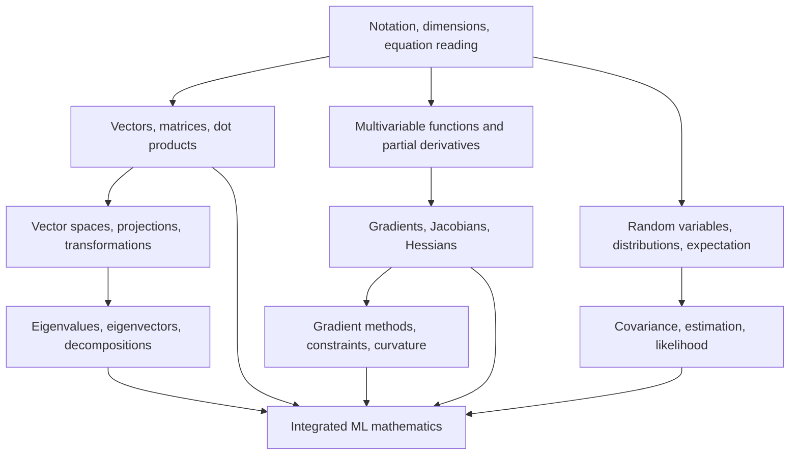

# ML mathematics adaptive dependency map

This is a route map, not a fixed syllabus. Select the next node from learner goals and evidence in `progress.md`.

## Node intent

| Node | What the learner should be able to do | Examples of later use |
| --- | --- | --- |
| Notation, dimensions, equation reading | Decode symbols, read indices, infer shapes, and narrate an equation | Every ML derivation |
| Vectors, matrices, dot products | Explain weighted combinations and matrix-vector products | Linear models and neural-network layers |
| Geometry and transformations | Reason about span, basis, projection, and transformation | Features, embeddings, least squares |
| Spectral ideas and decompositions | Explain eigenvectors and useful decompositions at the right depth | PCA and representations |
| Multivariable calculus | Interpret partial derivatives and local change | Loss functions |
| Gradient, Jacobian, Hessian | Read derivatives of vector- and scalar-valued functions | Backpropagation and curvature |
| Probability and statistics | Work with distributions, expectation, variance, covariance, and likelihood | Uncertainty and probabilistic models |
| Optimization | Explain objective geometry and iterative updates | Training models |
| Integrated ML mathematics | Combine the previous strands to read unfamiliar expressions | Textbooks and papers |

## Route adjustments

- A learner pursuing neural networks soon may take vectors → multivariable calculus → gradients → optimization before spectral ideas.
- A learner pursuing data analysis or probabilistic ML may take vectors → probability → statistics before optimization.
- Return to notation and dimensions whenever an expression exposes a gap; it is a cross-cutting strand, not an introductory unit to leave behind.
